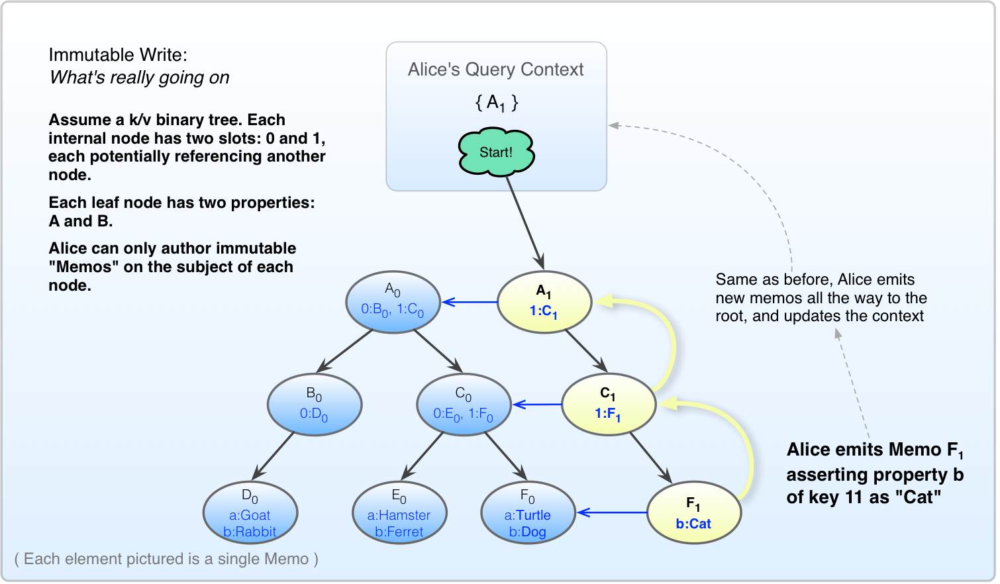
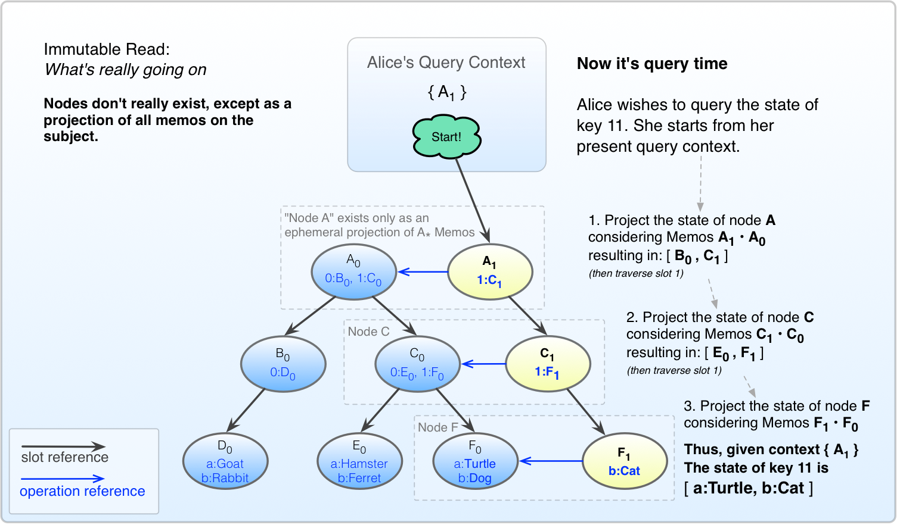
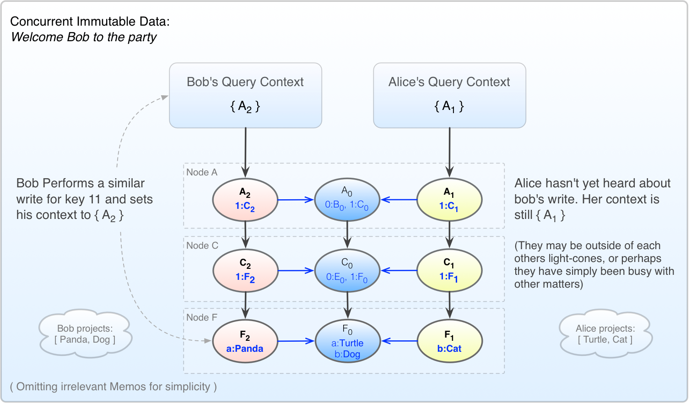
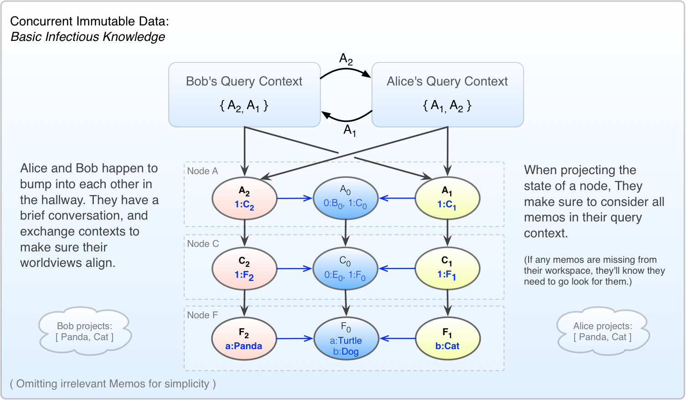
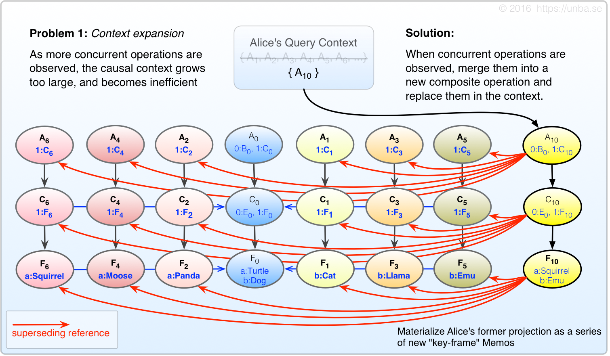
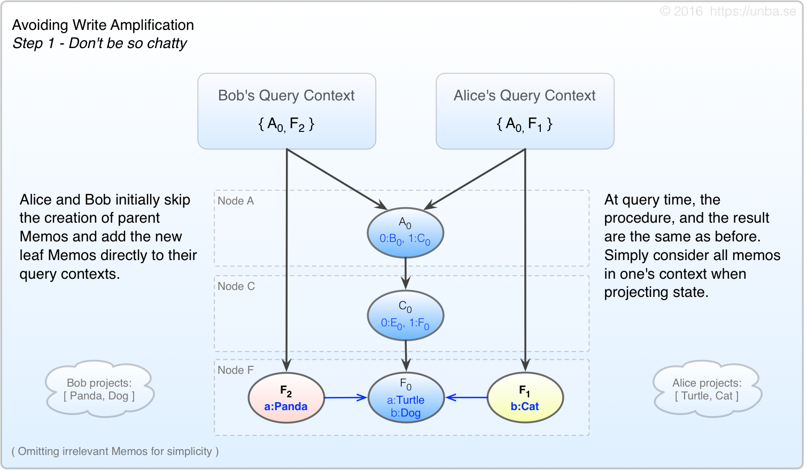

#### Synopsis

A key concept in the design ideology of Unbase is the earnest belief that **State is fundamentally ephemeral.**
We believe that state may be observed or projected, and *only events* may be stored or transported. We believe this to be true both metaphorically, and literally from a physics standpoint.

This may seem silly at first blush, or overly philosophical, but this interpretation allows us to reason about data in a way which confers interesting benefits.
Chief among them is that when resolving a conflict, we don't have to reconcile multiple states. We may instead reconcile *happenings* or *intentions.*
With careful optimization, we may also approximate the causal reality of the physical universe with reasonable efficiency.

Many modern database systems delegate authority to "shards", each purporting to be the referee and arbiter of state for some subset of the data in the system.
These systems seek to create walled gardens of correctness, while conveniently ignoring the consistency model of the overall system; inclusive of services, clients, etc. We argue that a query result-set, as executed by a traditional RDBMS client is simply a partial replica of the database with a poor consistency model.

In functional programming, it's very common to employ immutable data structures. These data structures are simple, elegant, and efficient, but seldom used in highly concurrent systems – for reasons we'll get into below.

Unbase seeks to expand the system model to encompass those nodes formerly considered to be "clients" as first-class participants in storage and computation, limited only by capacity and policy. An Unbase system may accommodate many thousands, or even millions of instances, while offering a first-principle-physics approach to latency reduction at every scale, and strong causal consistency guarantees. See [Consistency Model](consistency-model) for details.

----

So lets jump in!

 
 

### Alice has an immutable data structure

 
**Fig 1. Basic persistent data structure**
  

----

With immutable data structures, when an given value is "edited" it's *not* done by mutation, but rather by originating one or more new nodes, and recreating all parent nodes up to the root node. This provides a compact context against which all subsequent queries will experience a consistent worldview.

Now, Alice decides to make an edit. She keeps her root node in a basket of sorts, which we're calling the *Query Context.* By carrying around this Query context Alice can have a consistent view of her data and ensure that no stale data is observed. Once the new nodes are created, she swaps out the old root node for the new one in her Query context:

 
**Fig 2. Basic Immutable Edit**
 

----

Ok, so this is all super straightforward [persistent data structures](https://en.wikipedia.org/wiki/Persistent_data_structure){:target="define"} stuff right? But here's where things start to get interesting:

You might have thought Alice was writing out the whole record for **F** as **F1** but that's not what's happening in our case. Instead of writing out the whole record, she emits **F1**, which is an operation to be applied to, and is causally descendant of **F**. In Unbase, these are called "Memos", and *everything* is made of them.

 
**FIG 3. Ok, so we're emitting immutable Memos, not really editing "Nodes".**
 

----

As an exercise, lets ask Alice to perform a query of key 11:

 
**FIG 4. State is merely an ephemeral projection based on a point of view (query context in our case).**
 

----

 

### Concurrency - Welcome Bob

When others wish to edit key 11, they can go right ahead and emit Memos on the basis of what they know already. We don't want to wait for coordination. Unbase assumes that all resources are non-exclusive, and conflicts are to be resolved by their datatypes. (Data types and conflict resolution are discussed a bit later)

 
**FIG 5. Concurrency is introduced.**
 

----

When Alice and Bob bump into each other, if they're interested in having a conversation, they may exchange contexts.
When they each try to query the value of key 11 now, they must ensure that each node is projected while considering all memos in their query context.
For instance, Alice projects Node A slot 1 as:

**A1 • A2 • A0 = 1:[C1, C2, C0]**  
( slot 0 is omitted for simplicity )

Continuing in this manner, and assuming their contexts are the same, they will each arrive at the same value for key 11.

 
**FIG 6. Projection is performed with using all memos referenced by our context.**
 

In the event that Alice had additional memos added to her context by a third party after the discussion with Bob, her projections would at least be mindful of Bob's context, even if the projected state differed from Bob's.

#### Consistency Model

Once context is exchanged, there is no un-ringing that bell – ALL of that party's subsequent state projections must consider the accumulated context information up to that point. This [consistency-model](https://en.wikipedia.org/wiki/Consistency_model){:target="define"} which Unbase implements is referred to as **[Infectious Knowledge](consistency-model)**. All agents in the system, including clients, web browsers or otherwise, will be empowered by the Unbase system to exercise this manner of "causal fencing". The mechanism may be selectively relaxed when desired, but in all cases, the querying party has the option to project a state which is deterministic on the basis of their starting query context.

 

### What's the point? What have we gained?

Now we have a rudimentary coordination-free system which is capable of providing deterministic state projections for a given query context.
A handy benefit of this approach is that the lower-bound latency for state projection of a received context can approach the latency of the sending light-cone itself. This is as good as it gets folks, at least with presently-known physics anyway.

Yes, this lower-bound is a property which we share with many eventual-consistency databases too, *except* that we also get strong consistency in the bargain.
For a given query context, we get to know at query time if our data is stale or not. Sure, we may have to wait under some circumstances, but we will at least know that the data we're waiting for is probably in our receiving light-cone.

#### Note on Data Types:
The above scenarios employ a very basic Last-Write-Wins style approach for simplicity of illustration. Unbase seeks to natively support much more advanced data types than can reasonably be pictured here. See [Data Types](data-types) for more details.

 

### OK, so there are a few problems...

Alright, so there's no free lunch exactly. In setting up the above scenario, we have accumulated a few problems that we have to solve.

 

#### Problem #1 - Context Expansion

Inserting few Memos in your query context isn't so bad, but what about when we're around for a long time? Or when you invite a few million of your friends to the party? You have a serious context expansion problem.

 
**FIG 7. When Query context grows too large, materialize the projection as a series of "key-frame" memos, which supersede their predecessor memos.**

*(TODO: Determine if it's meaningful for the purposes of this document to differentiate between causal compaction and key-frame creation.)*

You might think to yourself *"hey, this is the same as state! I want my money back!"*
There's a key difference here though – while the key-frame memos are deterministic based on their precursors, and thus an effective optimization, we're decidedly *not* assuming that these Memos are the last word in state. If new Memos show up which do not descend the key-frame Memos, then we'll throw these key-frames away, and re-project them inclusive of *all* precursors, both old and newly-arrived. That said, it's possible that a precursor could show up from Alpha Centauri (or a long-offline service) and upset a lot of what we thought was stable history. We aim to give system maintainers a choice of if and how to to assimilate this.

 

#### Problem #2 – Write Amplification

Now that we have a mechanism to compress our context, we run smack into another problem:
Write amplification. For every payload-bearing memo we originate (more or less), we have to originate several more in order to work our way to the root node. Then, when our context grows sufficiently to hit our compaction threshold, there's several more memos to generate still. With a small number of writers, this isn't so bad really; but when we're in system with many writers, the overhead of write amplification could easily overwhelm available bandwidth and computational resources.

So how do we solve this?

 
**FIG 8. Initially, we skip the creation of parent memos, and simply add new leaf memos to the context.**
 

#### Challenge #3 – Distributed merging

* write amplification
* sparse vector clocks

### Some of the finer points

* implementation clarification ( What did we win? )
* Introduce: Model or Subject or Topic ( this is a design goal )
* Why do I need a consistency model for my index.
* To make the system scalable I need to be able to spread my data around without a priori planning ( also a design goal )
* But I also need to be able to find it!
* my data doesn't actually exist anywhere, by my edits are all over the place!
* probablistic merging and beacon pings

    

<!--

#### Here be dragons, using the stuff after this as a parts-bin for the above storyline

#### Probability-based merging

The downside of immutable data structure approach is that multiple editors in the system would cause a bunch of new intermediate and root nodes to be created. This wold eventually stabilize for a given set of e=ve

#### Sparse vector clock (Beacons)

TODO: Similar to interval tree clocks --
Assume you had a vector clock of unlimited width, and comparing vector clock readings is cheap.
Employ a distributed index tree as a way to locate

#### Indexes

#### Causal Context
* Allow continued operation during a network partition
 * Avoid CAP theorem limitations by abandoning linearizability in favor of [causal consistency](http://sns.cs.princeton.edu/projects/cops-and-eiger/)
 * Treat conflicts as inevitable, and allow them to be resolved systematically
* Destroy the distinction between client and server. They are considered identical **except** for policy, capability, and resources.
 * Access control enforcement at every stage of replication
 * Push business logic to initiators when possible, otherwise delegate to nearest capable node
* Virtualized objects, accessible from any node, complete with synchronous, asynchronous business logic enforcement
* Utilize [mesh networking](https://github.com/telehash/telehash.org/tree/master/v3) to allow ALL system participants ("clients" and "servers") to communicate directly, and around damage or network interruption

# Notes
No quorum logic shall be utilized. Provided the requisite data is available and sufficiently fresh according to its present causal context, a node, or cluster of nodes may continue functioning in the partitioned area without limitation, except as necessary to enforce durability guarantees; wherein the application logic may choose to whether to wait to reach the desired probability of durability or not.

-->
