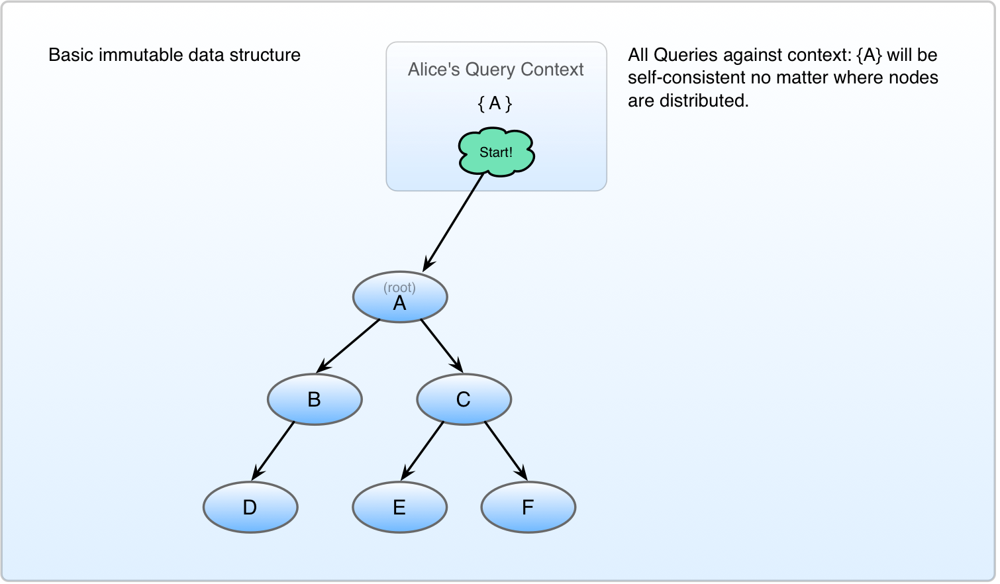
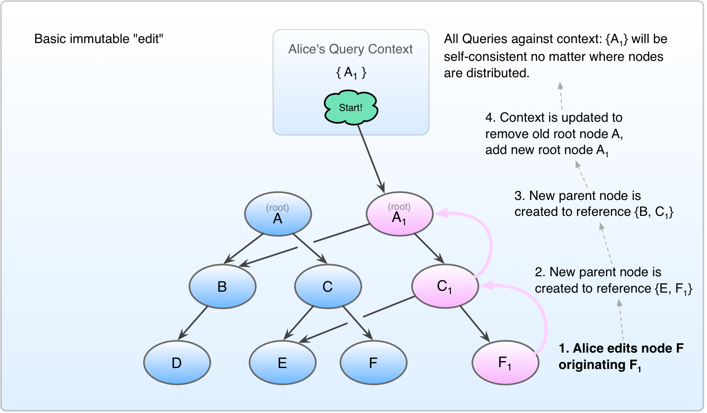

#### Synopsis

A key concept in the design ideology of Unbase is the belief that **State is ephemeral.**
We believe that state may be observed or projected, but *only events* may be stored or transported.

This may seem like splitting hairs, but this distinction allows us to reason about data in a way which confers interesting benefits.
Chief among them is that when resolving a conflict, we don't have to reconcile multiple states. We may instead reconcile *intentions.*
With careful optimization, we may also approximate the causal reality of the physical universe with reasonable efficiency.

Many modern database systems delegate authority to "shards", each purporting to be the referee and arbiter of state for some subset of the data in the system.
These systems seek to create walled gardens of correctness, while conveniently ignoring the consistency model of the overall system; inclusive of services, clients, etc. We argue that a traditional database client is simply a partial replica of the database with a poor consistency model.

In functional programming, it's very common to employ immutable data structures. These data structures are simple, elegant, and efficient, but seldom used in highly concurrent systems – for reasons we'll get into below.

Unbase seeks to expand the system model to encompass those nodes formerly considered to be "clients" as first-class participants in storage and computation, limited only by capacity and policy. An Unbase system may accommodate many thousands, or even millions of instances, while offering a first-principle-physics approach to latency reduction, and strong causal consistency guarantees. See [Consistency Model](consistency-model) for details.

----

Without further ado, lets jump in:

#### Immutable data

In immutable data structures, when an given node is edited, values are "edited" by originating one or more new nodes, and recreating all parent nodes up to the root node. This provides a compact context against which all subsequent queries will experience a consistent worldview.

 
Fig 1. Immutable data-structure baseline

 
Fig 2. Immutable data-structure edit

TODO 
Fig 3. Naive implementation of a distributed immutable data-structure

TODO 
Fig 4. Avoiding Write Amplification through probability-based merging

#### Probability-based merging

The downside of immutable data structure approach is that multiple editors in the system would cause a bunch of new intermediate and root nodes to be created. This wold eventually stabilize for a given set of e=ve

#### Sparse vector clock (Beacons)

TODO: Similar to interval tree clocks --
Assume you had a vector clock of unlimited width, and comparing vector clock readings is cheap.
Employ a distributed index tree as a way to locate

#### Indexes

#### Causal Context

* Allow continued operation during a network partition
 * Avoid CAP theorem limitations by abandoning linearizability in favor of [causal consistency](http://sns.cs.princeton.edu/projects/cops-and-eiger/)
 * Treat conflicts as inevitable, and allow them to be resolved systematically
* Destroy the distinction between client and server. They are considered identical **except** for policy, capability, and resources.
 * Access control enforcement at every stage of replication
 * Push business logic to initiators when possible, otherwise delegate to nearest capable node
* Virtualized objects, accessible from any node, complete with synchronous, asynchronous business logic enforcement
* Utilize [mesh networking](https://github.com/telehash/telehash.org/tree/master/v3) to allow ALL system participants ("clients" and "servers") to communicate directly, and around damage or network interruption

# Notes
No quorum logic shall be utilized. Provided the requisite data is available and sufficiently fresh according to its present causal context, a node, or cluster of nodes may continue functioning in the partitioned area without limitation, except as necessary to enforce durability guarantees; wherein the application logic may choose to whether to wait to reach the desired probability of durability or not.
